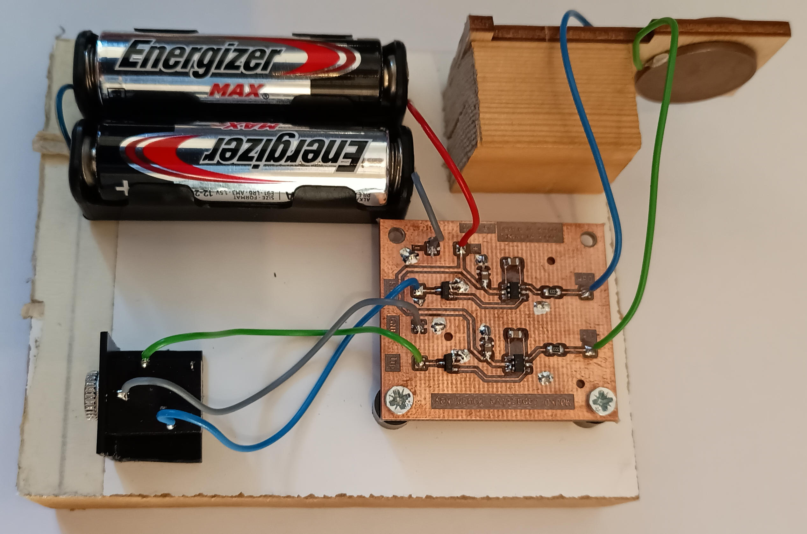

## Introduction ##

This project contains a kit for a CW-key (or morse key) that works without any mechanical parts but is based on electronic sensors. It is based on the circuit from [John, M0UKD](https://m0ukd.com/homebrew/capacitive-cw-touch-key-circuits/) and is extended within this project to a complete kit with housing and a construction of a CW sensor pad.

Many thanks to Stephan, DOxWWW and Christian, DJ2PH for thair support during the setup of this kit.
Thanks to [Ken, KM4NFQ](https://github.com/km4nfq/capacitive-touch-key) for his design and by that the starting point and inspiration for me on this kit.
Very many thanks to [John, M0UKD](https://m0ukd.com/homebrew/capacitive-cw-touch-key-circuits/) for the design of this great tiny circuit!

# all pieces needed for the complete kit #

To assemble the complete kit, you need this:
- the fully assembled electronics board (see "Electronics" section below)
- 4 distance bolts M2,5 with length 5mm (e.g. from [Reichelt](https://www.reichelt.de/de/de/shop/produkt/distanzbolzen_5_mm_m2_5-236284))
- 4 screws M2,5 x 5mm
- 8 washers for M2,5
- 8 lockwashers for M2,5
- 4 nut screws M2,5
- 1 holder for 2 batteries AAA (e.g. from [Reichelt](https://www.reichelt.de/de/de/shop/produkt/batteriehalter_fuer_2_microzellen_aaa_loetfahnen-57125))
- 1 switch (e.g. from [Reichelt](https://www.reichelt.de/de/de/shop/produkt/miniatur-kippschalter_ein-aus_3_a_125_v-359360))
- 1 stereo jack for 3,5mm (e.g. from [Reichelt](https://www.reichelt.de/de/de/shop/produkt/klinkeneinbaubuchse_3_5_mm_stereo-7301))
- the assembled CW Sensor Pad (see "Mechanics" section below)
- 2 screws M3 x ...mm
- 2 washers for M3
- 2 lockwashers for M3
- 2 nut screws for M3
- the housing Mammond 1550Q (e.g. from [Reichelt](https://www.reichelt.de/de/de/shop/produkt/alugehaeuse_1550_q_60_x_55_x_30_mm_aluminium-221407))
- material for mounting (see "Options for mounting" below)

## Electronics ##
The board used in this project was designed by [John, M0UKD](https://m0ukd.com/homebrew/capacitive-cw-touch-key-circuits/) and the KiCad file is based on the work of [Ken, KM4NFQ](https://github.com/km4nfq/capacitive-touch-key). It was changed in shape to fit in the housing and make the wiring easy. Also the Rs and Cs are changed to size 0805 (as this is the size I found in my laboratory).

During the soldering, be carefull due to the small size of the board, not to make short circuits or bridges of solder. Beyond that and due to the small amount of parts, the soldering is an easy thing.

# Bill of electronic parts #
- 1 x circuit board
- 2 x IRFML8244 MOSFETs, SMD SOT-23
- 2 x AT42QT1011 Touch sensors, SMD (U1, U2)
- 2 x 22K Ohm resistors, SMD 0805
- 2 x 0.1uF capacitors, SMD 0805
- 2 x 2.2nF capacitors, SMD 0805

## Mechanics ##

# The CW sensor pad #
The pad is designed to use coins as sensor fields. For Germany/Europe Euro coins are easily accessible. That was the reason, why 10 Euro-Cent coins will fit in the sensor (diameter 19.75mm, width nearly 2mm). If you intend to use other dimensions, adapt the FreeCad files as neede.

The sensor pad consists of multiple pieces of 2mm wood to be cut by e.g. a laser cutter. 

# Putting the pieces together #

# Options for mounting #
As the kit is intended for universal use, you can descide for which purpuse you like to use it in your case. It can be for portable operation (due to its small size and good closure thus resistance against dirt) or for use in your shack.

For portable use, you can mount strong magnets on the buttom side of the key. With them you can attach the key to any (magnetic) surface you like (your portable TRX, a metal case, ...).

For use only in your shack, you can mount the bottom side of the key directly to a heavy item like a metal plate (e.g. steal with 8cm x 8cm x 2cm) or a stone plate (looks great). For this mounting, you drill holes according to the holes for the screws in the housing through yor item and replace the screws of the housing with longer ones suitable for your item dimension. In this way you mount your item, the buttom of the housing and the top of the housing in once.

## History ##

The first prototype is shown here. It was my first try on how good the circuit works and was made by parts I found after receiving the board. I also verified with this construction, that coins are suitable sensor pads (here 5 Euro-Cent coins).

The second prototype is shown here. With this I verified the construction of the CW sensor pad and the fitting of all parts in the Mammond housing. It is near the final kit design.
