# Introduction #

This project contains a kit for a CW-key (or morse key) that works without any mechanical parts but is based on electronic sensors. The idea and initial designs comes from [John, M0UKD](https://m0ukd.com/homebrew/capacitive-cw-touch-key-circuits/) and is extended within this project to a complete kit with housing and a construction of a CW sensor pad.

Many thanks to [Christian, DJ9PH](https://www.qrz.com/db/DJ9PH), and Stephan, DO2WWW, for their support during the development of this kit.
Additionally Christian designed the housing for 3D printing. It looks great and 
Thanks to [Ken, KM4NFQ](https://github.com/km4nfq/capacitive-touch-key) for his design of the circuit board in [KiCad](https://www.kicad.org/) and by that being the starting point and inspiration for me on this kit.
Very many thanks to [John, M0UKD](https://m0ukd.com/homebrew/capacitive-cw-touch-key-circuits/) for the great idea and documentation of this tiny circuit!

# Available as a kit #

The key and the 3D printed housing are available as kit from AATIS as set number [AS686]{https://www.aatis.de}.

## pieces needed for the complete kit ##

To assemble the complete kit, you need this:
- the fully assembled electronics board (see "[Electronics](#electronics)" section below)
- the assembled CW Sensor Pad (see "[The CW sensor pad](#the-cw-sensor-pad)" section below)
- housing:
  - metal housing Mammond 1550Q see below ["metal Housing"](#metal-housing)
  - 3D printed housing, see below ["3D printed Housing"](#3d-printed-housing)
- 1 holder for 2 batteries AAA (e.g. from [Reichelt](https://www.reichelt.de/de/de/shop/produkt/batteriehalter_fuer_2_microzellen_aaa_loetfahnen-57125))
- 1 switch (e.g. from [Reichelt](https://www.reichelt.de/de/de/shop/produkt/miniatur-kippschalter_ein-aus_3_a_125_v-359360))
- 1 stereo jack for 3,5mm (e.g. from [Reichelt](https://www.reichelt.de/de/de/shop/produkt/klinkeneinbaubuchse_3_5_mm_stereo-7301))
- material for mounting (see ["Options for mounting"](#options-for-mounting) below)

# Electronics #
The board used in this project was initially designed by [John, M0UKD](https://m0ukd.com/homebrew/capacitive-cw-touch-key-circuits/) and the [KiCad](https://www.kicad.org/) file is based on the work of [Ken, KM4NFQ](https://github.com/km4nfq/capacitive-touch-key). It was changed in shape to fit in the housing and make the wiring easy. 

## Bill of electronic parts ##
- 1 x circuit board
- 2 x IRFML8244TRPBF MOSFETs, SMD SOT-23 (Q1, Q2)
- 2 x AT42QT1011 Touch sensors, SMD (U1, U2)
- 2 x 22K Ohm resistors, SMD 1206 (R1, R2)
- 2 x 0.1uF capacitors, SMD 1206 (C1, C3)
- 2 x 2.2nF capacitors, SMD 1206 (C2, C4)

## Building the circuit board ##

During the soldering, be careful due to the small size of the board and parts, not to make short circuits or bridges of solder. Beyond that and due to the small amount of parts, the soldering is an easy thing.

There are some vias in the board to ensure the GND level to be reliability available on all places needed. The back of the board is connected to GND (except the small places for connecting the wires).

(pictures follow soon)

# Mechanics #

## The CW sensor pad ##
The pad is designed to use coins as sensor fields. For Germany/Europe Euro coins are easily accessible. That was the reason, why 10 Euro-Cent coins will fit in the sensor (diameter 19.75mm, width nearly 2mm). If you intend to use other dimensions, adapt the [FreeCAD](https://www.freecad.org/) files as needed.

The sensor pad consists of multiple pieces of 2mm wood to be cut by e.g. a laser cutter. In the development of this kit I found, that the "2mm" plates are only 1.9 mm in with, so the holes for fitting together the single plates are designed for this width. If you have really 2.0 mm wide plates, use a file or a piece of sand paper to adjust the width of the holes to your need.

The sensor pad consists of 6 pieces of wood:
- 2 rectangular holder plates
- 2 middle plates which differ in the position of the "wire channel" from each other
- 2 side plates with round holes to fit the coins

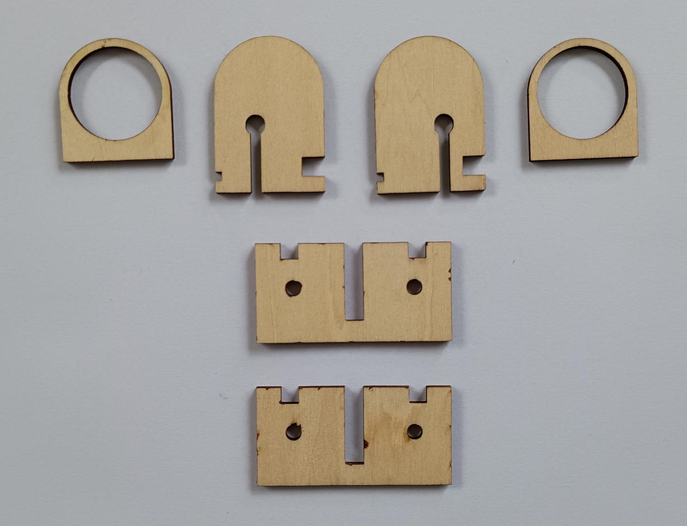

First step:
- glue together the 2 rectangular holders
- glue together the 2 middle plates

Take care that the each two pieces lie exactly on top of each other!

After having glued the first parts, it should look like this:
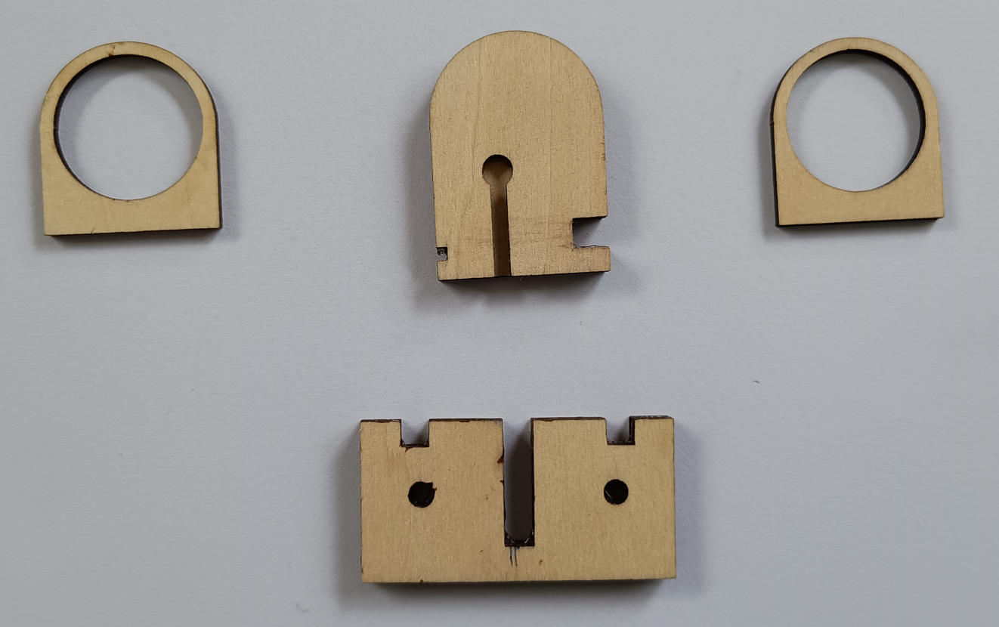

Now glue the side plates on each side of the middle plates. Also here, take care that they lie exactly in the right position.

Now you have two pieces:
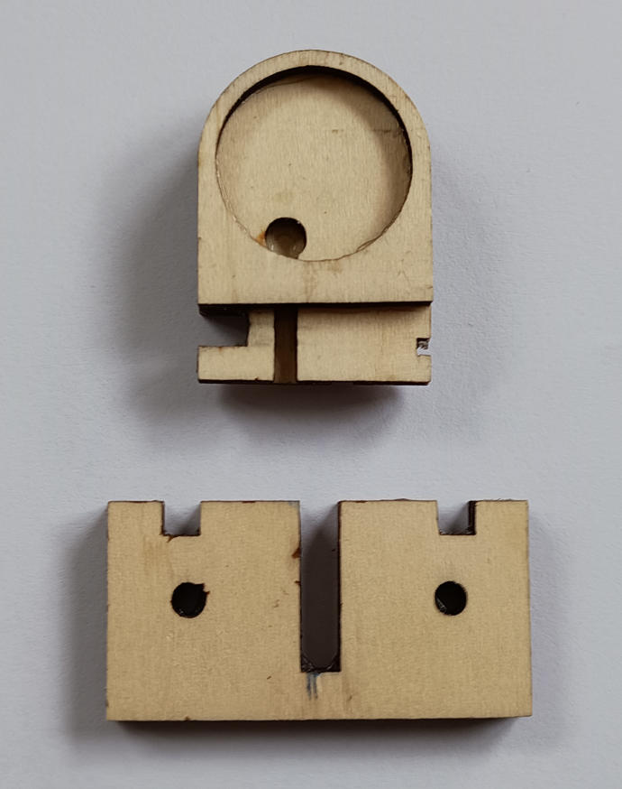

Now set the holder in the hole at the end of the pad. Take care, that it is directly connected to the back side of the side plates. This ensures the correct alignment in up/down direction. Also take care, that the sensor pad part and the holder have a good rectangular orientation to ensure a correct alignment to the left and right.

Your assembled sensor pad should look like this:
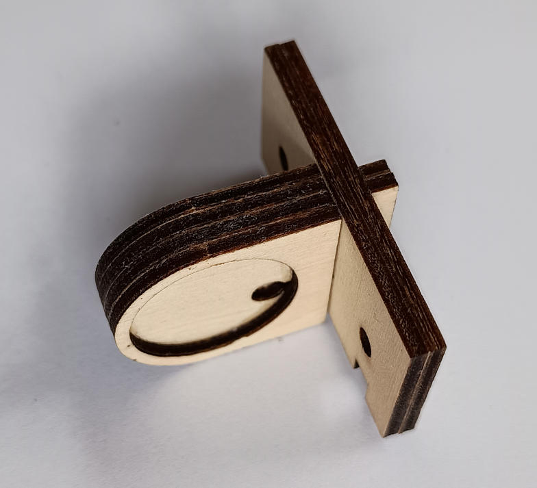

The next step is to prepare the coins. Solder the wires on them (next to the edge). The solder spot should be not to big (it must fit in the small hole below the coin in the pad). Prior to soldering, clean the surface of the coin on the place you want to solder with a screwdriver to remove the oxide layer that normally covers the coin.
It should look like this at the end of this step:
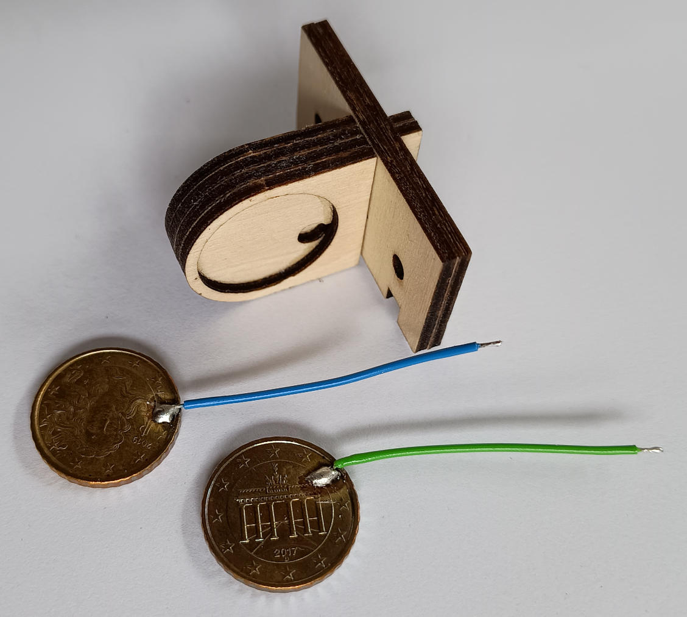

Now insert the wires in the small holes below the holders of the coins, so that they exit the pad at the back side. The coins should fit perfectly in the holder plates and it should look like this. If there are residue of the glue in the holes for the wires, clean them with a thin drill.
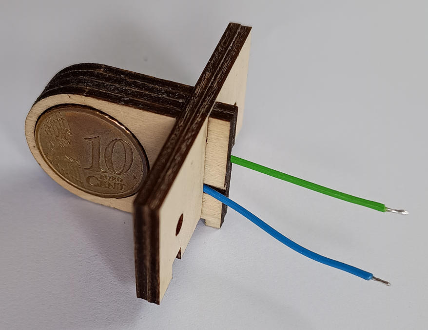

Glue the coins in the holder plates and/or use some plastic tape to prevent them from falling out. With that, your sensor pad is complete and can be installed in the housing.

## Metal housing ##

For a metal housing, you need the following components:
- the housing Mammond 1550Q (e.g. from [Reichelt](https://www.reichelt.de/de/de/shop/produkt/alugehaeuse_1550_q_60_x_55_x_30_mm_aluminium-221407))
- 4 distance bolts M2,5 with length 5mm (e.g. from [Reichelt](https://www.reichelt.de/de/de/shop/produkt/distanzbolzen_5_mm_m2_5-236284))
- 4 screws M2,5 x 5mm
- 8 washers for M2,5
- 8 lock washers for M2,5
- 4 nut screws M2,5

- for mounting the CW Sensor Pad, you need:
  - 2 screws M3 x 10mm
  - 2 washers for M3
  - 2 lock washers for M3
  - 2 nut screws for M3

Preparing the Mammond 1550Q

### Hole for sensor paddle ###

First mark the middle of the _wider_ side (green on the next picture).

Than mark nearly 2mm to each side (blue on the next picture). In sum it must meet the width of your paddle. It is ok, if it is a tight fit.
The hight of the marking is 23mm to meet the height of the paddle.

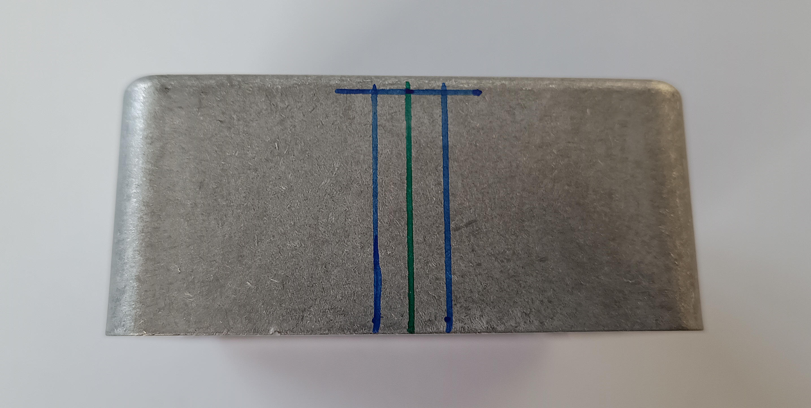

Than take a metal saw to cut out the opening along the outer lines (the blue ones in the picture above). Use a key file to make the opening accurately rectangular.

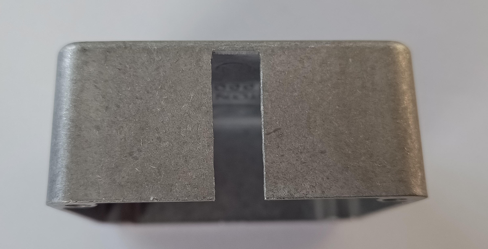

Next mark the hole for the paddle holder. You can measure it (12mm from the bottom and 30mm apart). To make sure it fits with your holder, additionally place the holder it the opening you just prepared and use the holes in the wooden plates to mark points for the holes (or verify your measurement).

Than drill the holes to fit with the 3mm screws. If you use countersunk screws, also drill the lowering.

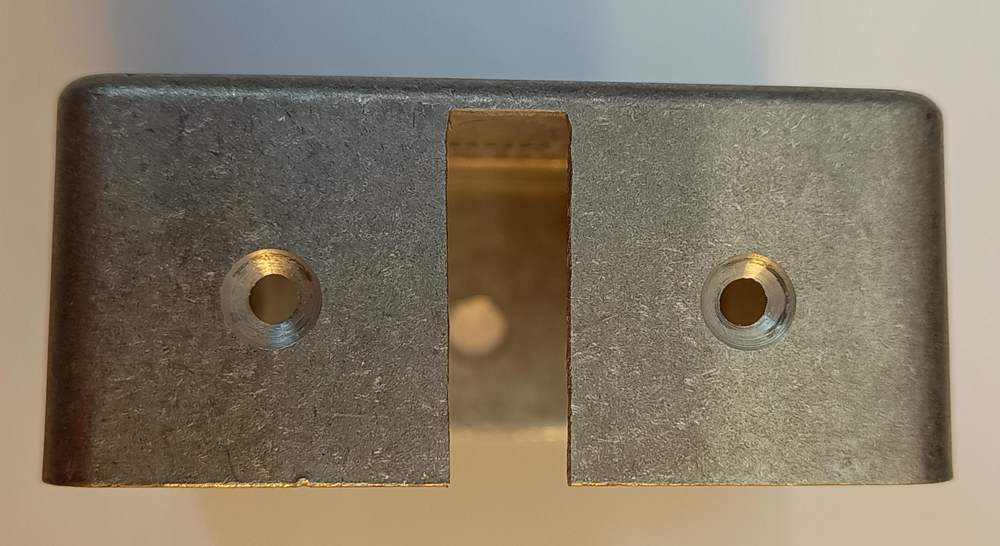

### Holes for the board ###

Place the paddle in its position (you can also use the screws to temporarily holt it in place). Than lay the circuit board inside the housing and position it so that the holder of the paddle protrudes into the recess.

To have enough room for the switch and connector at the back side, place the circuit board as tight as possible next to the paddle holder.

Mark the points for the holes and drill them to fit the 2.5mm screws. As well here: if you use countersunk screws, also drill the lowering.

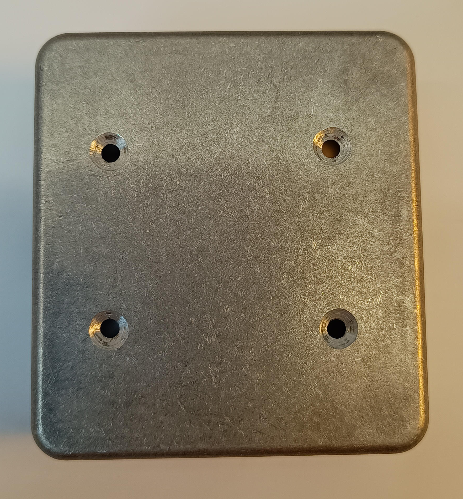

### Holes for connector and switch ###

The positioning of the holes for the connection and the switch is somewhat difficult. 

Depending of the parts you use, they can either be positions on the side next to the circuit board or you can position the connector centered "above" the circuit board and only the switch side next of it.

Be careful to leave enough space for the circuit board with the bolts holding it and the batterie holder, which is placed on top of the circuit board.

This picture shows the installation side next to the board (on one of the prototypes):
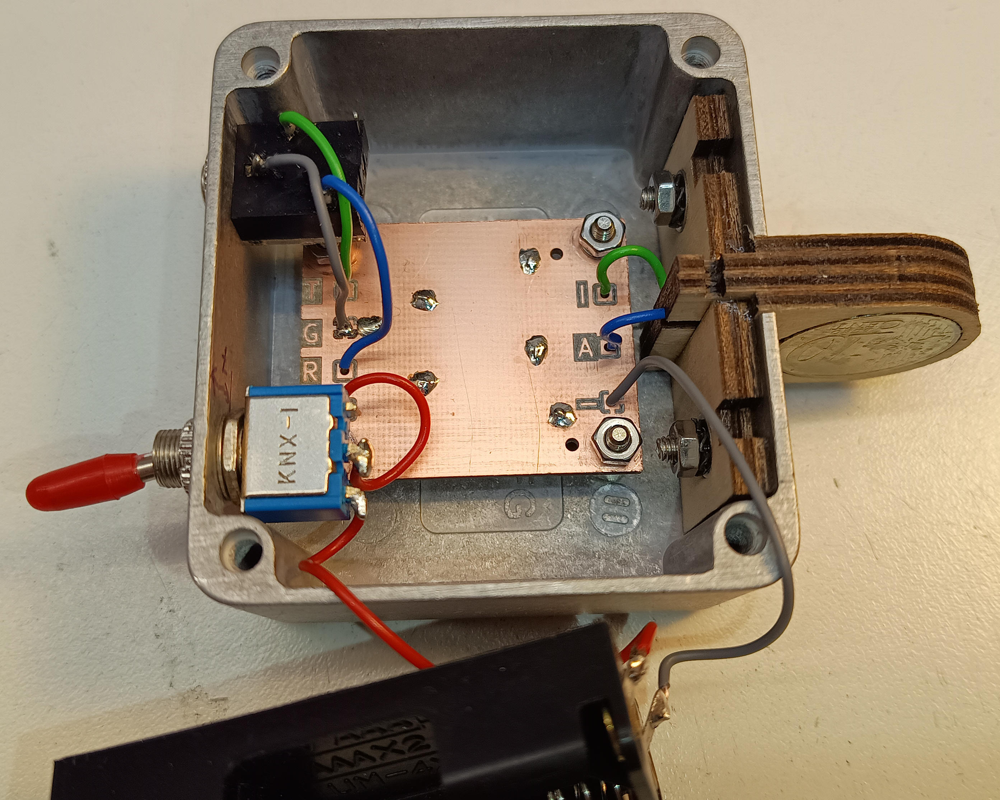

This picture shows the holes for the connector centered and the switch at the side:
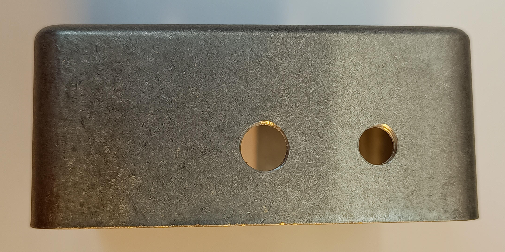

So you can place it as you like it best. For example: according to the hand you want to use the key, place the switch on the side "away" from you to have it out of your way during usage.

### Putting the pieces in the metal housing ###
Here you see the suggested mounting order seen on the third prototype. How to find the places for the holes in the housing will be explained here in a later version of the README.

First set the bolts for holding the board in the housing using lock washers to keep it tight:
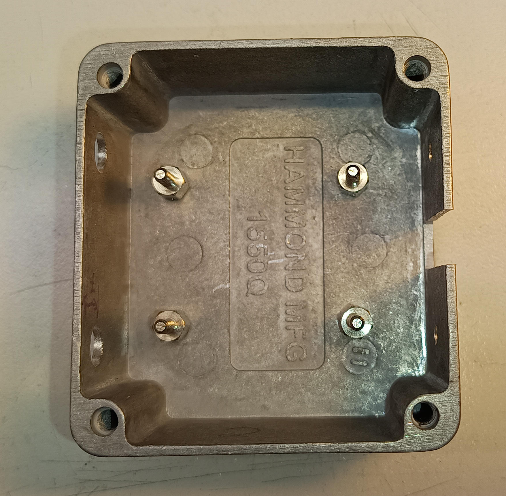

Second fix the board on the bolts with the nuts (including washers):
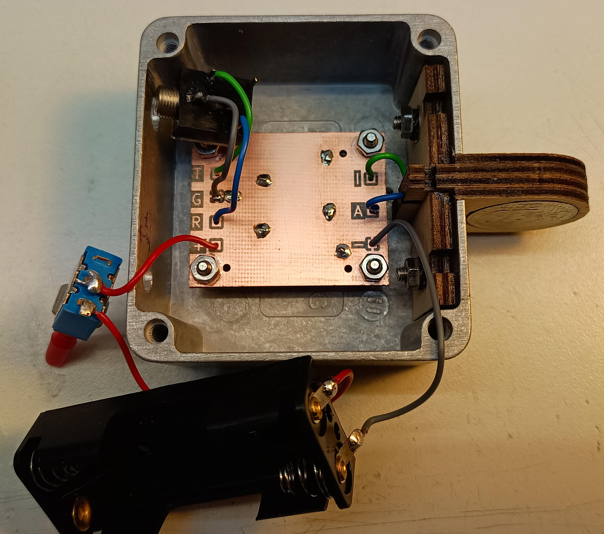

Then fix the sensor pad, the connector and the switch in its holes:

As the last step, mount the battery holder on the board. 

There are two options:
- using some double-sided adhesive tape: Use strong adhesive tape, preferably one with a layer of silicone, which is often recommended for outdoor use.
- use the hole in the center of the board to screw the battery holder to the board. Therefore, you need an _additional_ M2.5 screw with plate, washer plate and nut (not mentioned in the part list on top of the page)
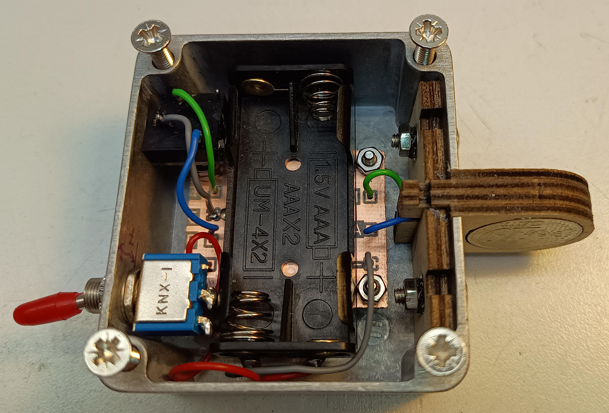

Now you can close the housing and your key is complete (or you want to add magnets as a mounting option, what ist explained in the next section).

## 3D printed housing ##

For the 3D printed housing you need the following:
- 3D printed housing, a bottom and a top part (files to be found under mechanics/housing)
- 12 press-fit sleeves M3
  - 4 of them only if you want to attach magnets below the hosing (see ["Options for mounting"](#options-for-mounting) below)
- 4 screws M3 x 8mm (holding the circuit board)
- 4 screws M3 x min 10mm (connecting the two parts of the hosing)

- for mounting the CW Sensor Pad, you need:
  - 2 screws M3 x 10mm
  - 2 washers for M3
  - 2 lock washers for M3
  - 2 nut screws for M3

### The press-fit sleeves ###

First, the press-fit sleeves must be installed. It is recommend to use an installation aid to ensure that they are pressed in straight. If this is not available, please use a conical soldering iron tip and hold it absolutely straight.

The press-in nuts of the magnet should also be pressed in from the INSIDE to ensure a secure hold.

### The sensor pad ###

The sensor pad is inserted in the rectangular hole in the same way as for the metal housing. The screws are inserted from the outside with plates and washer plates and nuts inside. 

### The electronics ###

WILL BE COMPLETED LATER

## Options for mounting ##
As the kit is intended for universal use, you can decide for which purpose you like to use it in your case. It can be used for portable operation (due to its small size and good closure thus resistance against dirt) or for use in your shack.

For portable use, you can mount strong magnets on the bottom side of the housing. With them you can attach the key to any (magnetic) surface you like (your portable TRX, a metal case, ...). This is the way, many portable keys work (like those from [Palm](https://www.eham.net/reviews/view-product/11153) or other companies).

Possible sources for the magnets are (listed as *examples*)
- [Supermagnete](https://www.supermagnete.de/neodym-magnete-zum-anschrauben/quadermagnet-zum-anschrauben-40-x-20-x-4mm_CS-Q-40-20-04-N)
- [Amazon](https://www.amazon.de/dp/B08F54YGC9)

This is, how it can look:
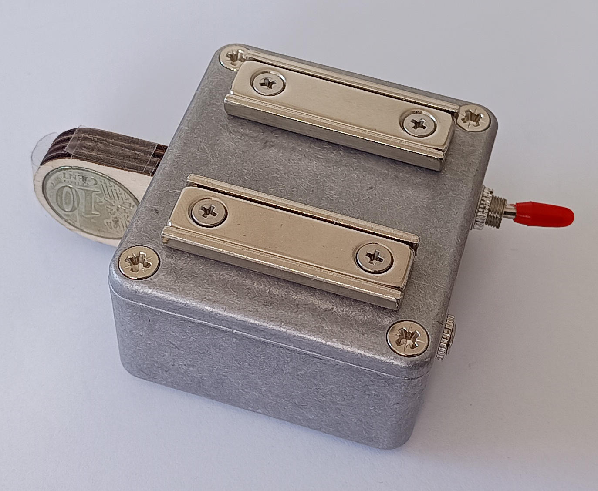

For use only in your shack, you can mount the bottom side of the key directly to a heavy item like a metal plate (e.g. steal with 8cm x 8cm x 2cm) or a stone plate, with probably looks great). For this mounting, you drill holes according to the holes for the screws in the housing through yor item and replace the screws of the housing with longer ones suitable for your item dimension. In this way you mount your item, the bottom of the housing and the top of the housing in once.

# History #

## First Prototype ##
The first prototype is shown here. It was my first try on how good the circuit works and was made by parts I found after receiving the board. I also verified with this construction, that coins are suitable sensor pads (here 5 Euro-Cent coins).
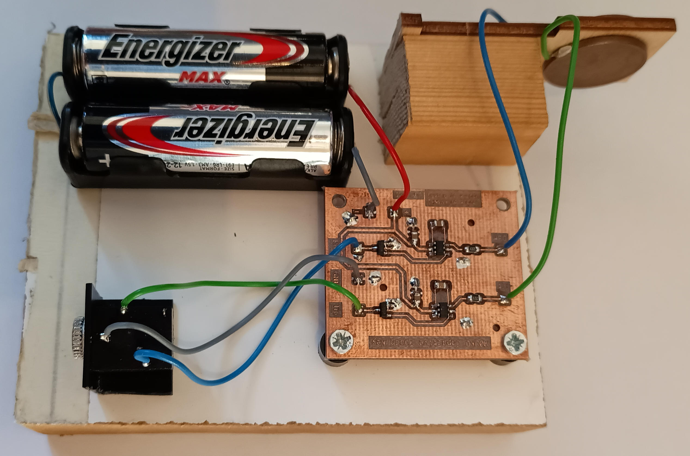

## Second Prototype ##
I changed the first prototype by replacing the "testing" sensor pad with first example made from laser cutted wood.
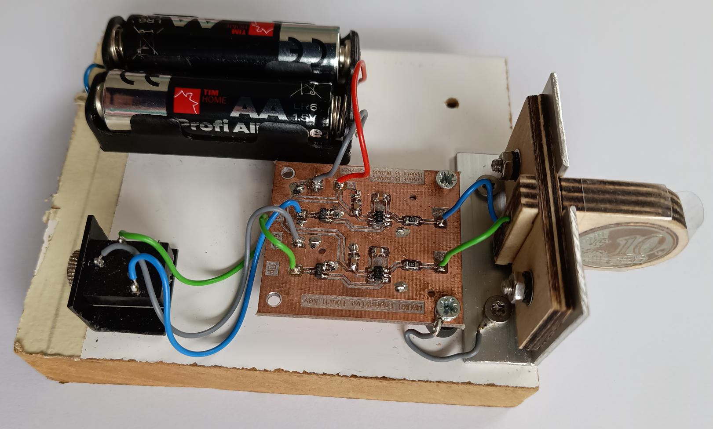

## Third prototype ## ##
After some changes to the board to reduce its size and place the solder pads on either sides, the third prototype became available. Here you see its construction.

This is the electronic connected with all external components:
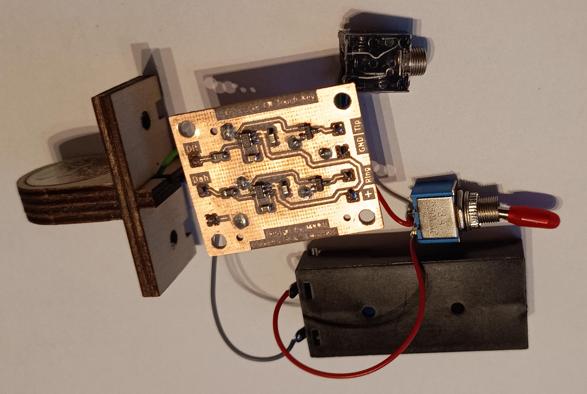

This is the same showing the bottom side of the board (where the battery holder is glued on):
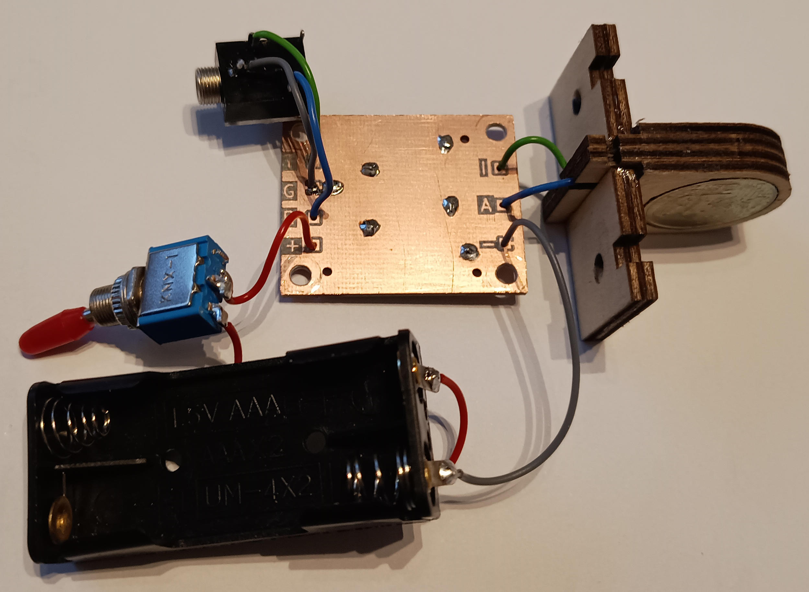

And theses are pictures of the whole key in its housing:
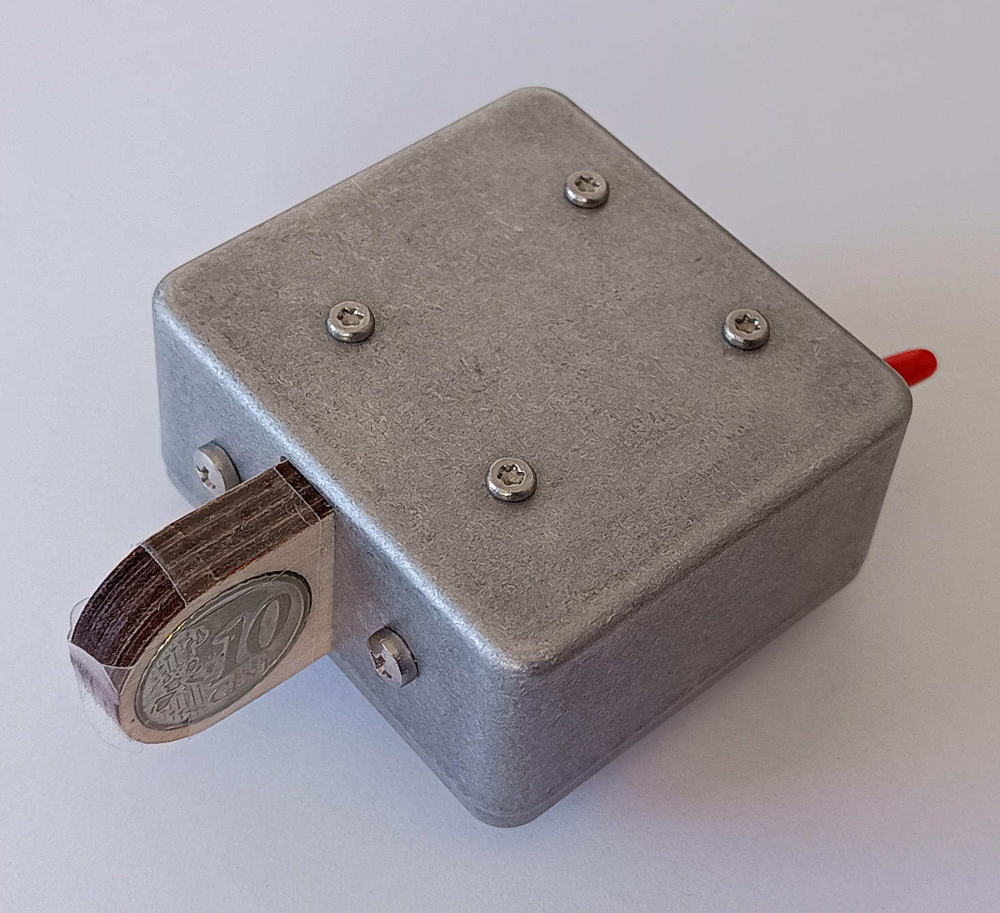

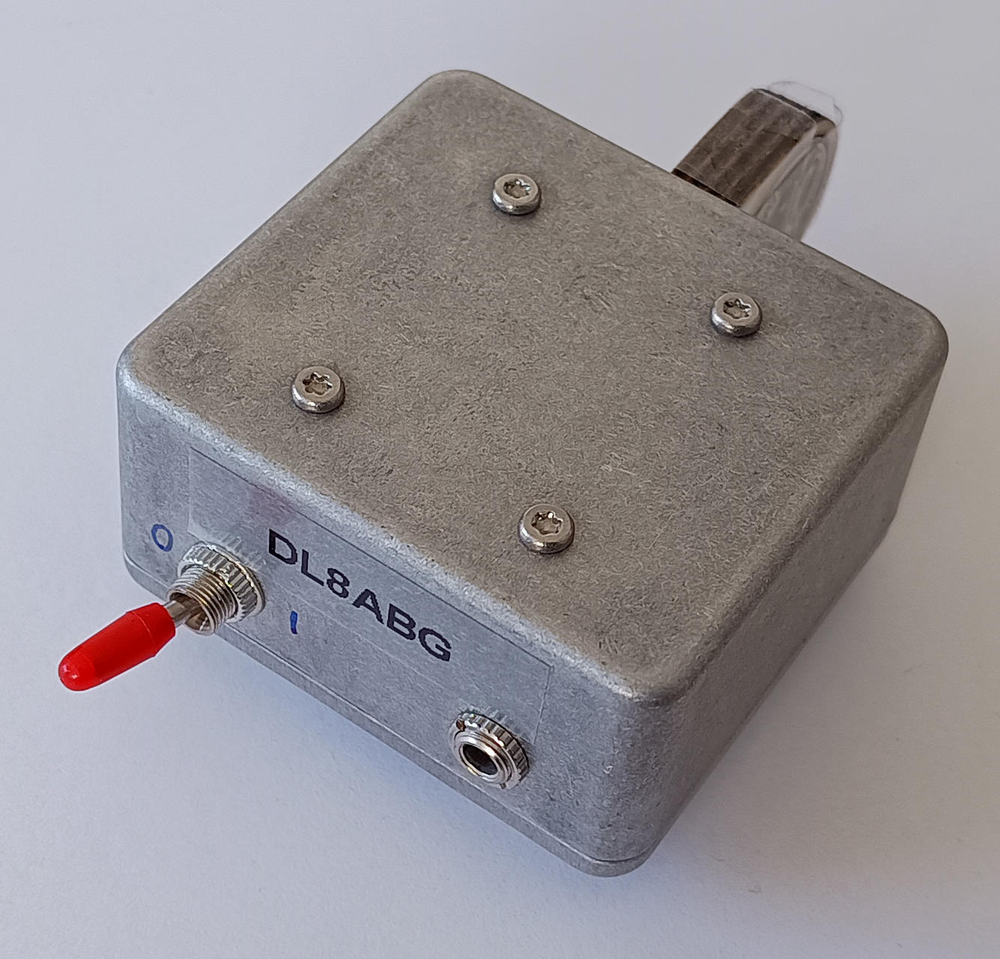

(coming soon)
Slight changes are necessary to enhance the fit of all parts in the housing.

# Responsibility #
This kit is build by **you**. You are responsible for all safety and legal aspects on building and operation!! 

The author is not liable for anything, as he only shows his ideas on how such a sensor key can be build.
