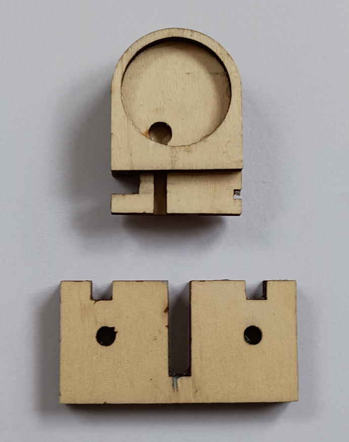

# Introduction #

This project contains a kit for a CW-key (or morse key) that works without any mechanical parts but is based on electronic sensors. The idea and initial designs comes from [John, M0UKD](https://m0ukd.com/homebrew/capacitive-cw-touch-key-circuits/) and is extended within this project to a complete kit with housing and a construction of a CW sensor pad.

Many thanks to [Christian, DJ9PH](https://www.qrz.com/db/DJ9PH), and Stephan, DO2WWW, for thair support during the development of this kit.
Thanks to [Ken, KM4NFQ](https://github.com/km4nfq/capacitive-touch-key) for his design of the circuit board in [KiCad](https://www.kicad.org/) and by that being the starting point and inspiration for me on this kit.
Very many thanks to [John, M0UKD](https://m0ukd.com/homebrew/capacitive-cw-touch-key-circuits/) for the great idea and documentation of this tiny circuit!

## all pieces needed for the complete kit ##

To assemble the complete kit, you need this:
- the fully assembled electronics board (see "[Electronics](#electronics)" section below)
- the assembled CW Sensor Pad (see "[Mechanics](#mechanics)" section below)
- the housing Mammond 1550Q (e.g. from [Reichelt](https://www.reichelt.de/de/de/shop/produkt/alugehaeuse_1550_q_60_x_55_x_30_mm_aluminium-221407))
- 4 distance bolts M2,5 with length 5mm (e.g. from [Reichelt](https://www.reichelt.de/de/de/shop/produkt/distanzbolzen_5_mm_m2_5-236284))
- 4 screws M2,5 x 5mm
- 8 washers for M2,5
- 8 lockwashers for M2,5
- 4 nut screws M2,5
- 1 holder for 2 batteries AAA (e.g. from [Reichelt](https://www.reichelt.de/de/de/shop/produkt/batteriehalter_fuer_2_microzellen_aaa_loetfahnen-57125))
- 1 switch (e.g. from [Reichelt](https://www.reichelt.de/de/de/shop/produkt/miniatur-kippschalter_ein-aus_3_a_125_v-359360))
- 1 stereo jack for 3,5mm (e.g. from [Reichelt](https://www.reichelt.de/de/de/shop/produkt/klinkeneinbaubuchse_3_5_mm_stereo-7301))
- 2 screws M3 x 10mm
- 2 washers for M3
- 2 lockwashers for M3
- 2 nut screws for M3
- material for mounting (see "Options for mounting" below)

# Electronics #
The board used in this project was initally designed by [John, M0UKD](https://m0ukd.com/homebrew/capacitive-cw-touch-key-circuits/) and the [KiCad](https://www.kicad.org/) file is based on the work of [Ken, KM4NFQ](https://github.com/km4nfq/capacitive-touch-key). It was changed in shape to fit in the housing and make the wiring easy. Also the resistors and capacitors are changed to size 0805 (as this is the size I found in my laboratory).

During the soldering, be carefull due to the small size of the board and parts, not to make short circuits or bridges of solder. Beyond that and due to the small amount of parts, the soldering is an easy thing.

There are some vias in the board to ensure the GND level to be reliablity available on all places needed. The back of the board is connected to GND (except the small places for connecting the wires).

## Bill of electronic parts ##
- 1 x circuit board
- 2 x IRFML8244TRPBF MOSFETs, SMD SOT-23 (Q1, Q2)
- 2 x AT42QT1011 Touch sensors, SMD (U1, U2)
- 2 x 22K Ohm resistors, SMD 0805 (R1, R2)
- 2 x 0.1uF capacitors, SMD 0805 (C1, C3)
- 2 x 2.2nF capacitors, SMD 0805 (C2, C4)

# Mechanics #

## The CW sensor pad ##
The pad is designed to use coins as sensor fields. For Germany/Europe Euro coins are easily accessible. That was the reason, why 10 Euro-Cent coins will fit in the sensor (diameter 19.75mm, width nearly 2mm). If you intend to use other dimensions, adapt the [FreeCAD](https://www.freecad.org/) files as needed.

The sensor pad consists of multiple pieces of 2mm wood to be cut by e.g. a laser cutter. In the development of this kit I found, that the "2mm" plates are only 1.9 mm in with, so the holes for fitting together the single plates are designed for this width. If you have realy 2.0 mm wide plates, use a file or a piece of sand paper to adjust the width of the holes to your need.

The sensor pad consists of 6 pieces of wood:
- 2 rectangular holder plates
- 2 middle plates which differ in the position of the "wire channel" from each other
- 2 side plates with round holes to fit the coins

First step:
- glue together the 2 rectangular holders
- glue together the 2 middle plates

Take care that the each two pieces lie exactly on top of each other!

After having glued the first parts, it should look like this:

Now glue the side plates on each side of the middle plates. Also here, take care that they lie exactly in the right position.

Now you have two pieces:

Now set the holder in the hole at the end of the pad. Take care, that it is directly connected to the back side of the side plates. This ensures the correct allignment in up/down direction. Also take care, that the sensor pad part and the holder have a good rectangular orientation to ensure a correct allignment to the left and right.

Your assembled sensor pad should look like this:

The next step is to prepare the coins. Solder the wires on them (next to the edge). The solder spot should be not to big (it must fit in the small hole below the coin in the pad).
It should look like this at the end of this step:

Now insert the wires in the small holes below the holders of the coins, so that they exit the pad at the back side. The coins should fit perfectly in the holder plates and it should look like this:

Glue the coins in the holder plates and/or use some plastic tape to prevent them from falling out. With that, your sensor pad is complete and can be installed in the housing.

## Putting the pieces together ##

## Options for mounting ##
As the kit is intended for universal use, you can descide for which purpuse you like to use it in your case. It can be used for portable operation (due to its small size and good closure thus resistance against dirt) or for use in your shack.

For portable use, you can mount strong magnets on the buttom side of the housing. With them you can attach the key to any (magnetic) surface you like (your portable TRX, a metal case, ...). This is the way, many portable keys work (like those from [Palm](https://www.eham.net/reviews/view-product/11153) or other comanies).

For use only in your shack, you can mount the bottom side of the key directly to a heavy item like a metal plate (e.g. steal with 8cm x 8cm x 2cm) or a stone plate, with probably looks great). For this mounting, you drill holes according to the holes for the screws in the housing through yor item and replace the screws of the housing with longer ones suitable for your item dimension. In this way you mount your item, the buttom of the housing and the top of the housing in once.

# History #

## First Prototype ##
The first prototype is shown here. It was my first try on how good the circuit works and was made by parts I found after receiving the board. I also verified with this construction, that coins are suitable sensor pads (here 5 Euro-Cent coins).

## Second Prototype ##
I changed the first prototype by replacing the "testing" sensor pad with first example made from laser cutted wood.

## Third protototype ##

(comming soon)
The second prototype is shown here. With this I verified the construction of the CW sensor pad and the fitting of all parts in the Mammond housing. It is near the final kit design.
